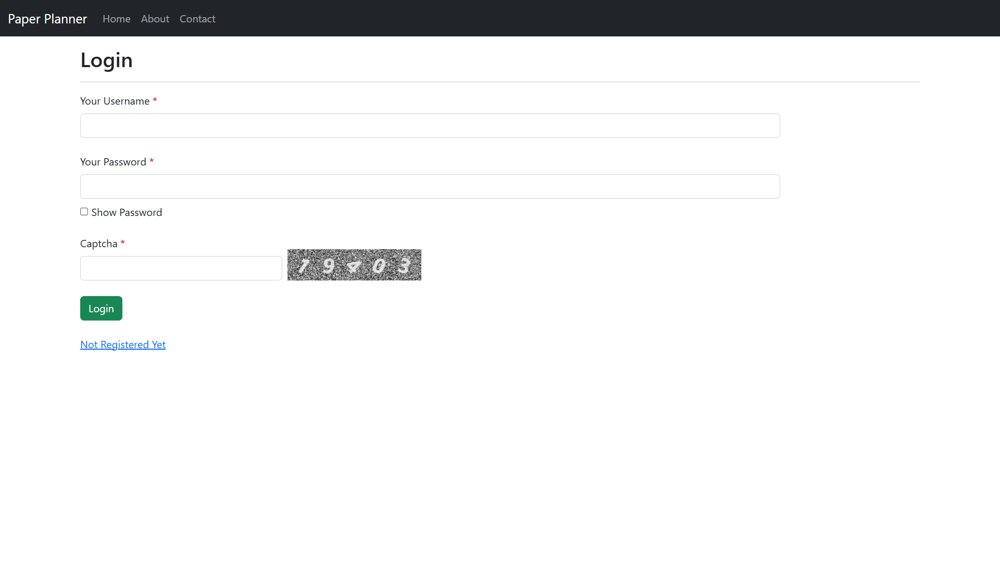

# Paper Planner

Paper Planner is a comprehensive platform designed to streamline the paper-setting and evaluation process for educational institutions. The system empowers Admins to manage papers, questions, and users, while Teachers can create and submit papers for approval. Students can easily create accounts, attempt assigned papers, and view their results. Also, Question can have dynamic options like every question can have different number of options as per need

## Technologies Used

- HTML
- CSS
- Javascript
- Bootstrap
- C#
- ASP.NET
- MVC

## Screenshots

Login Page:

